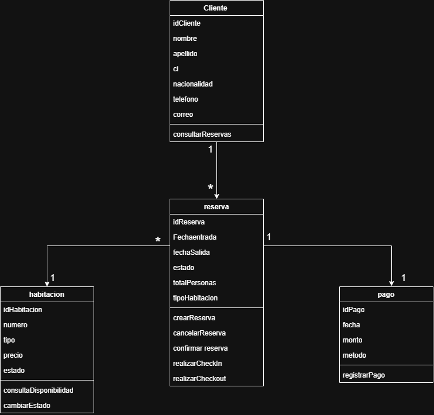
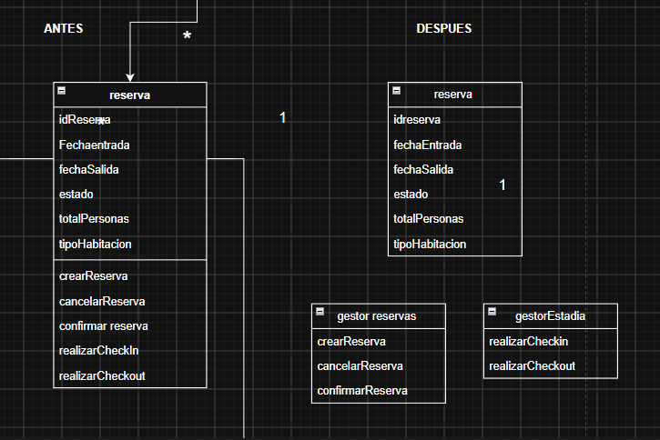
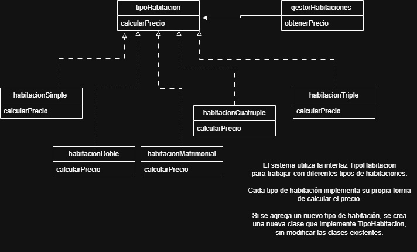
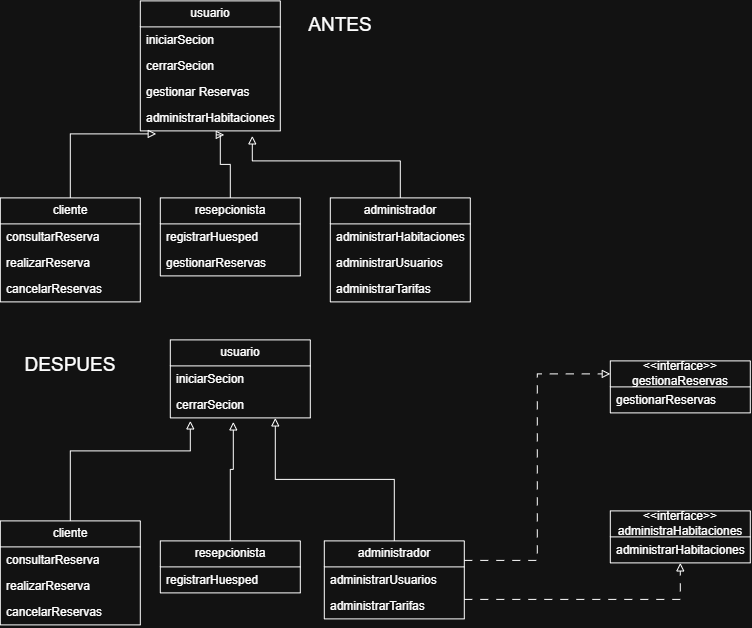
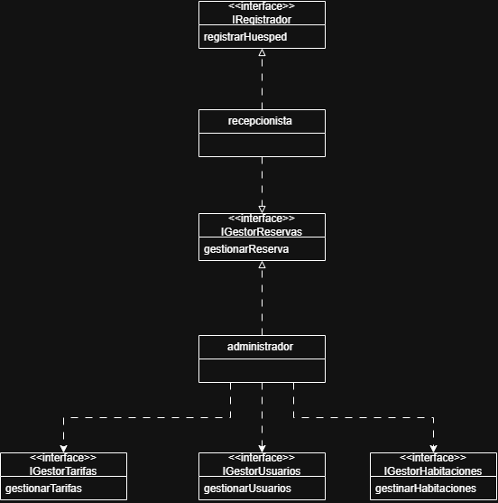
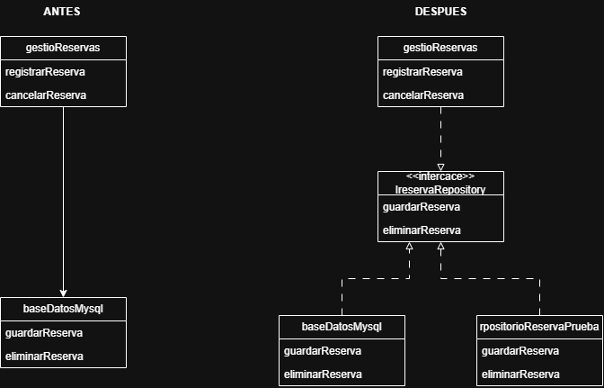

# h1 sistema de reservas de un hostal 

nombre: Gonzalo Exequiel Bautista 
variante 3 

## 1: Actores 

### 1. Cliente o huesped 
Consulta habitaciones disponibles
Realiza reservas
Cancela reservas
Consulta sus reservas

### 2. Recepcionista 
Registra huéspedes
Gestiona reservas
Consulta la disponibilidad de habitaciones

### 3. Administrador
Administra habitaciones
Administra usuarios
Gestiona tarifas
Consulta información del hostal

### 4. Personal de limpieza
Consulta el estado de las habitaciones
Actualiza el estado de las habitaciones después de la limpieza

## 2:Inventarios de modulos 

### 1. Gestión de habitaciones
Responsabilidad: 
Administrar las habitaciones y su disponibilidad.

### 2. Gestión de reservas
Responsabilidad:
Crear, modificar, cancelar y consultar reservas.

### 3. Gestión de huéspedes
Responsabilidad:
Registrar y administrar la información de los huéspedes.

### 4. entrada y salida del huesped 
Responsabilidad:
Gestionar la entrada y salida de los huéspedes.

### 5. Gestión de pagos

Responsabilidad:
Registrar y controlar los pagos de las reservas.

## 3: diagrama de clases UML 

Primer borrador del diagrama de clases 

## 4: Atributos de calidad criticos 

### 1. Seguridad

La seguridad es un atributo crítico porque el sistema manejará
información personal de los huéspedes, reservas y pagos. Se deben controlar
los accesos según el tipo de usuario para evitar modificaciones o accesos
no autorizados a la información.

### 2. Disponibilidad

La disponibilidad es crítica porque el sistema será utilizado
para consultar habitaciones y gestionar reservas durante las operaciones
del hostal. Una interrupción del sistema podría impedir registrar reservas,
consultar disponibilidad y realizar correctamente la atención al huésped.

# Práctica 1 SOLID 

## Responsabilidad Única

### Problema

En mi diseño inicial, la clase `Reserva` tenía varias funciones, como crear, cancelar y confirmar una reserva, además de hacer el check-in y check-out. Vi que estaba haciendo demasiadas cosas.

### Solución

Para aplicar SRP, separé esas funciones en diferentes clases. Dejé `Reserva` para guardar los datos de la reserva, `GestorDeReservas` para crear, cancelar y confirmar reservas, y `GestorDeEstadia` para realizar el check-in y check-out.

### Resultado

Con este cambio, cada clase tiene una responsabilidad más clara. Así, si necesito cambiar algo de las reservas, modifico `GestorDeReservas`, y si cambia el proceso de check-in o check-out, modifico `GestorDeEstadia`.

## Diagrama de la práctica SRP

# Práctica 2 SOLID 

## Principio Abierto/Cerrado

### Problema

En el sistema pueden existir diferentes tipos de habitaciones. Si se utilizara un switch para identificar cada tipo, sería necesario modificar el código cada vez que aparezca un nuevo tipo.

### Solución

Creé la interfaz `TipoHabitacion`, que contiene el método `calcularPrecio()`. Luego cada tipo de habitación implementa esta interfaz.

### Resultado

El sistema puede trabajar con diferentes tipos de habitaciones sin modificar las clases existentes. Si aparece un nuevo tipo, solamente se crea una nueva clase que implemente `TipoHabitacion`.

## Diagrama OCP

# Práctica 3 SOLID - LSP

## Principio de Sustitución de Liskov

### Problema

En el diseño inicial, la clase `Usuario` tenía funciones que no todos sus hijos podían realizar. Por ejemplo, un `Cliente` no debería administrar habitaciones ni gestionar las reservas de otros huéspedes.

### Solución

Se dejó en `Usuario` solamente las funciones comunes a todos los usuarios: iniciar sesión y cerrar sesión.

Las funciones específicas se separaron mediante las interfaces `GestionaReservas` y `AdministraHabitaciones`.

`Recepcionista` implementa `GestionaReservas`, mientras que `Administrador` implementa `GestionaReservas` y `AdministraHabitaciones`.

### Resultado

Cada clase cumple solamente las funciones que puede realizar. De esta manera, los hijos pueden sustituir correctamente a su clase padre sin generar comportamientos incorrectos.

## Diagrama LSP

## Práctica 4 solid - Los contratos de mis roles

Para mi sistema de reservas de un hostal trabajé con los roles
Recepcionista y Administrador.

El Recepcionista tiene las capacidades de registrar huéspedes y
gestionar reservas.

El Administrador puede gestionar reservas, habitaciones, usuarios
y tarifas.

La capacidad que comparten ambos roles es la gestión de reservas.

Para evitar que un rol tenga métodos que no necesita, separé las
capacidades en diferentes interfaces: IRegistrador, IGestorReservas,
IGestorHabitaciones, IGestorUsuarios e IGestorTarifas.

De esta manera cada rol solamente implementa las interfaces que
corresponden a sus funciones.

Si se utilizara una sola interfaz con todas las funciones, el
Recepcionista tendría que implementar funciones que pertenecen al
Administrador. Por eso es mejor separar los contratos.

### Diagrama UML

## Práctica 5 - Caza tus new peligrosos

En mi sistema de reservas de un hostal encontré que la gestión de
reservas podría depender directamente de una base de datos MySQL.

El problema es que GestionReservas quedaría dependiendo directamente
de un detalle específico.

Para solucionarlo creé la interfaz IReservaRepository como contrato.
Esta interfaz tiene los métodos guardarReserva() y eliminarReserva().

GestionReservas ahora depende de IReservaRepository y no directamente
de BaseDatosMySQL.

BaseDatosMySQL implementa la interfaz IReservaRepository.

También creé RepositorioReservaPrueba, que implementa la misma
interfaz y permite realizar pruebas sin utilizar una base de datos
real.

De esta manera puedo cambiar la implementación de la base de datos
sin modificar la lógica de GestionReservas.

### Diagrama

