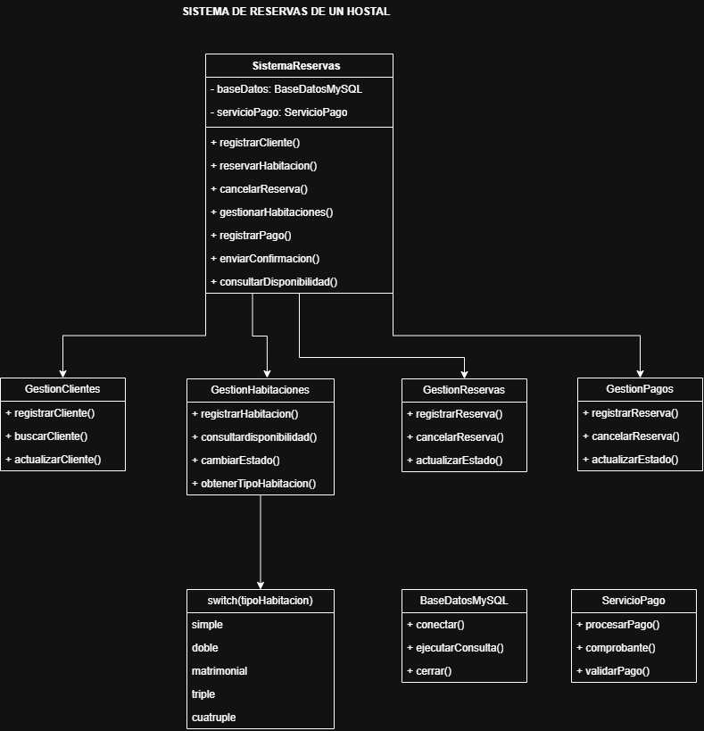
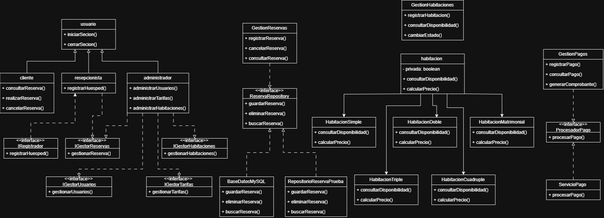

# H2 - Diagrama antes y despues 
# H2 - Sistema de Reservas de un Hostal

## 1. Diagrama antes

Este es el diseño realizado en el H1, donde se pueden observar los problemas iniciales del sistema.

## 2. Diagrama despues

En este diseño se aplicaron los principios SOLID para mejorar la organización del sistema.

## 3. Explicacioon de los cambios

En el diseño anterior tenía varias responsabilidades juntas, por eso separé las funciones en diferentes clases aplicando SRP.
Eliminé el switch que dependía del tipo de habitación y utilicé diferentes clases para cada tipo, aplicando OCP.
En Usuario dejé solamente las funciones comunes y separé las capacidades específicas aplicando LSP.
También separé los contratos de los diferentes roles mediante interfaces, aplicando ISP.
Para las reservas hice que GestionReservas dependa de IReservaRepository y no directamente de BaseDatosMySQL, aplicando DIP.
También mantuve RepositorioReservaPrueba para poder realizar pruebas sin utilizar una base de datos real.
Con estos cambios el diseño queda más organizado, flexible y fácil de mantener.
