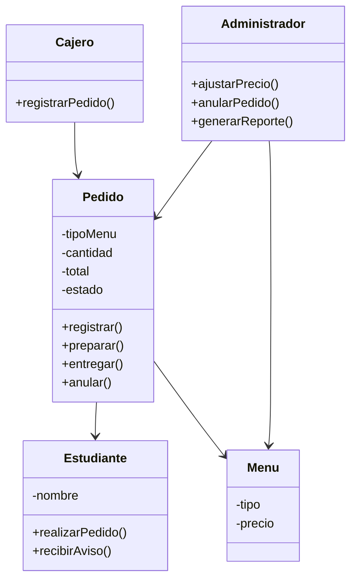

# diagrama 

```mermaid
classDiagram

class Pedido {
    -tipoMenu
    -cantidad
    -total
    -estado
    +registrar()
    +preparar()
    +entregar()
    +anular()
}

class Estudiante {
    -nombre
    +realizarPedido()
    +recibirAviso()
}

class Cajero {
    +registrarPedido()
}

class Administrador {
    +ajustarPrecio()
    +anularPedido()
    +generarReporte()
}

class Menu {
    -tipo
    -precio
}

Pedido --> Estudiante
Pedido --> Menu
Cajero --> Pedido
Administrador --> Pedido
Administrador --> Menu
```

