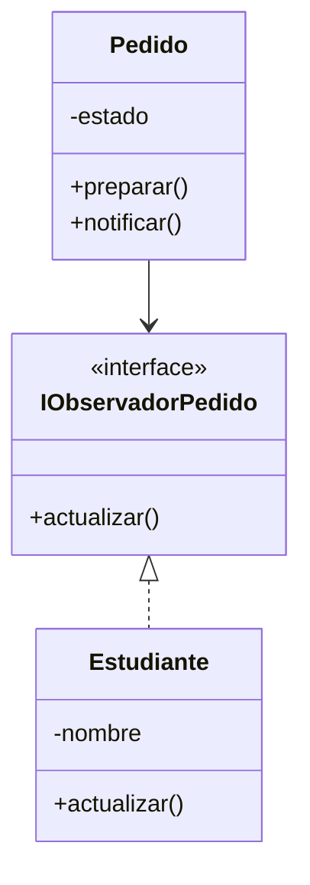

# Patron elegido Observer

## Requerimiento

Cuando un pedido pasa al estado **preparado**, el estudiante debe recibir un aviso.

## Patrón elegido

Para este caso se utilizará el patrón **Observer**.

La idea es que el Pedido avise cuando cambie su estado a preparado y el Estudiante reciba ese aviso

## Diagraama

