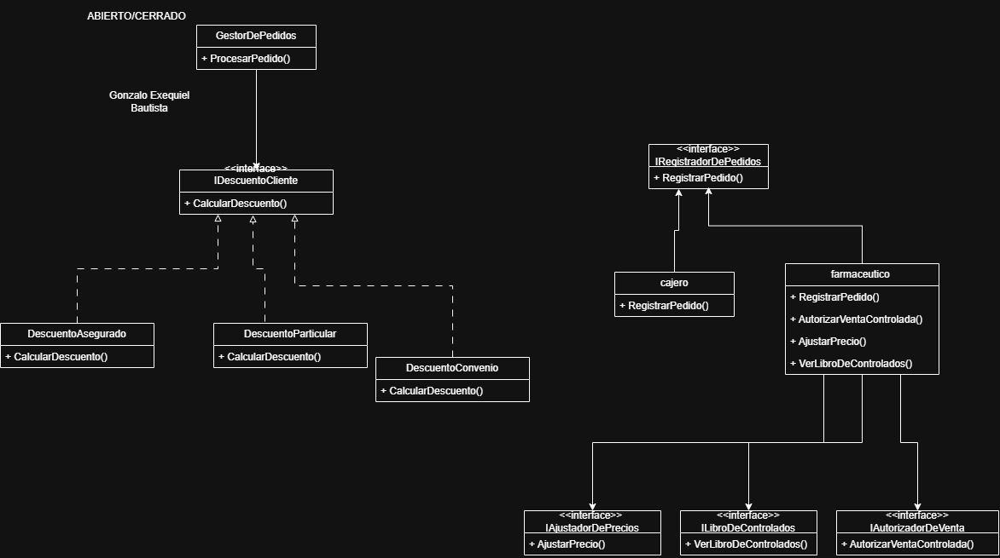

#PARCIAL 1  ARQUITECTURA DE SOFTWARE 

Nombre: Gonzalo Exequiel Bautista

##primer problema

principio                                         
Los contratos de mis roles (I)     

donde vive
En la interfaz IempleadodeFarmacia y en la clase cajero  

Por qué es una violación 
por que el cajero tiene funciones que no necesita 

## segundo problema 

principio
Abierto/Cerrado (O)

 Donde vive 
 En la clase gestordepedidos  metodo procesarpedido

 Por qué es una violación 
 por que si aparece otro tipo de cliente tengo que modificar el switch

## tercer problema 

principio                                         
 Caza tus new peligrosos

 donde vive 
 En la clase gestordepedidos  metodo procesarpedido

 Por qué es una violación 
 GestorDePedidos crea directamente la base de datos y el correo con new, entonces depende directamente de esas clases

 ##cuarto problrma 
 princpio 
 Abierto/Cerrado 

 donde vive 
 En la clase gestordepedidos  metodo procesarpedido

 Por qué es una violación 
Este método hace muchas cosas diferentes en un solo lugar

 
 
 

 
