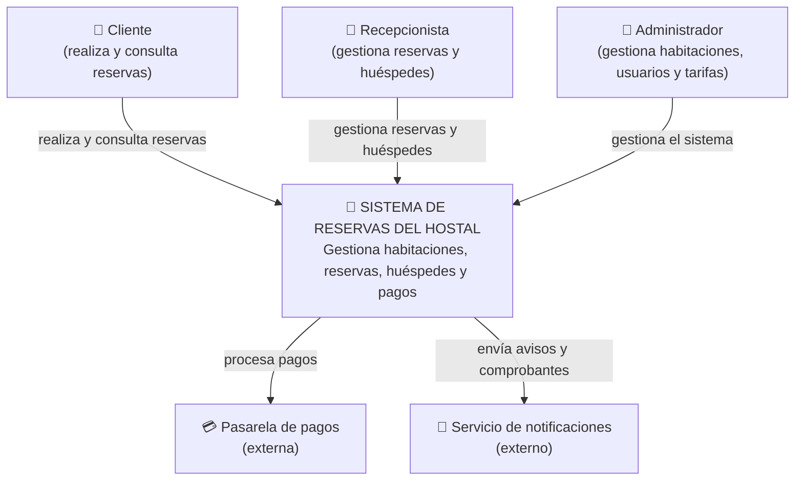

# C4 - Sistema de Reservas de un Hostal

## Nivel 1 - Contexto

En este nivel se muestra el sistema de reservas del hostal y las personas y sistemas externos que tienen relación con el aquí se puede ver quién utiliza el sistema y para qué lo utiliza ademas de los servicios externos que ayudan al funcionamiento del sistema.

## Nivel 2 - Contenedores

En este nivel se muestran las partes principales que están dentro del sistema de reservas del hostal aqui se puede ver dónde se encuentra la logica del sistema donde se guardan los datos como se gestionan los pagos y cómo se envían los avisos

