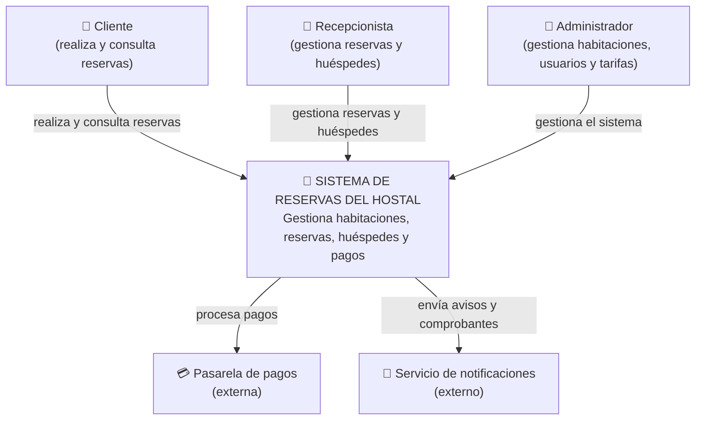
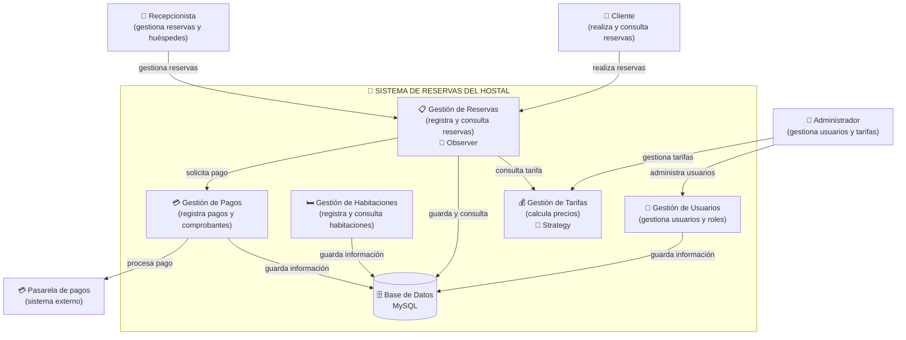

# H4 - Arquitectura del Sistema de Reservas del Hostal

## Nivel 1 — Contexto

En este nivel mostramos el sistema de reservas del hostal desde una vista general aquí se pueden ver las personas que utilizan el sistema y los sistemas externos que tienen relación con él.

## Elementos del contexto

**Cliente:** es la persona que utiliza el sistema para consultar habitaciones, realizar reservas, consultar sus reservas y cancelarlas.

**Recepcionista:** utiliza el sistema para registrar huéspedes y gestionar las reservas del hostal.

**Administrador:** utiliza el sistema para gestionar habitaciones, usuarios y tarifas.

**Sistema de Reservas del Hostal:** es el sistema principal. Su función es gestionar las habitaciones, reservas, huéspedes, usuarios, tarifas y pagos.

**Pasarela de pagos:** es un sistema externo que representa el servicio utilizado para procesar los pagos de las reservas.

**Servicio de notificaciones:** representa un servicio externo que puede recibir los avisos generados por el sistema.

### Relaciones principales

- El **Cliente** utiliza el sistema para realizar y consultar reservas.
- La **Recepcionista** utiliza el sistema para gestionar reservas y huéspedes.
- El **Administrador** utiliza el sistema para administrar las diferentes partes del sistema.
- El **Sistema de Reservas** se relaciona con la **Pasarela de pagos** para procesar pagos.
- El **Sistema de Reservas** puede enviar avisos mediante el **Servicio de notificaciones**.

---

## Nivel 2 — Contenedores

En este nivel mostramos las principales partes que están dentro del sistema de reservas del hostal.

La pregunta que responde este nivel es:

**¿De qué partes principales está compuesto el sistema?**

Aquí se muestran los módulos principales y la forma en que se relacionan entre ellos.

## Elementos de los contenedores

**Gestión de Reservas:** permite registrar y consultar y cancelar las reservas. También utiliza el patrón **Observer** para notificar a los usuarios interesados cuando se registra una nueva reserva.

**Gestión de Tarifas:** se encarga de calcular el precio de las habitaciones. Utiliza el patrón **Strategy** para aplicar diferentes formas de cálculo según el tipo de habitación y si es privada o compartida.

**Gestión de Habitaciones:** permite gestionar las habitaciones del hostal y consultar su disponibilidad.

**Gestión de Usuarios:** permite gestionar los usuarios y sus diferentes roles dentro del sistema.

**Gestión de Pagos:** permite registrar los pagos y comprobantes relacionados con las reservas.

**Base de Datos MySQL:** almacena la información utilizada por el sistema, como reservas, habitaciones, usuarios y pagos.

**Pasarela de pagos:** representa un sistema externo utilizado para procesar los pagos de las reservas.

### Relaciones entre los contenedores

- El **Cliente** realiza reservas mediante **Gestión de Reservas**.
- La **Recepcionista** utiliza **Gestión de Reservas** para administrar las reservas.
- El **Administrador** utiliza **Gestión de Usuarios** y **Gestión de Tarifas**.
- **Gestión de Reservas** consulta **Gestión de Tarifas** para obtener el precio de la habitación.
- **Gestión de Reservas** guarda y consulta información en la **Base de Datos MySQL**.
- **Gestión de Reservas** solicita el procesamiento de pagos a **Gestión de Pagos**.
- **Gestión de Pagos** se comunica con la **Pasarela de pagos**, que representa un sistema externo.
