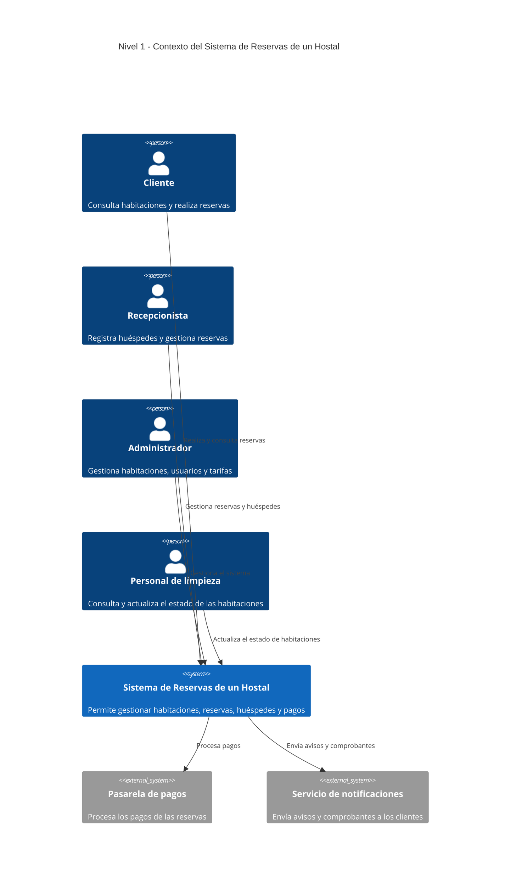

# C4 - Sistema de Reservas de un Hostal

## Nivel 1 - Contexto

```mermaid
C4Context

title Nivel 1 - Contexto del Sistema de Reservas de un Hostal

Person(cliente, "Cliente", "Consulta habitaciones y realiza reservas")
Person(recepcionista, "Recepcionista", "Registra huéspedes y gestiona reservas")
Person(administrador, "Administrador", "Gestiona habitaciones, usuarios y tarifas")
Person(limpieza, "Personal de limpieza", "Consulta y actualiza el estado de las habitaciones")

System(sistema, "Sistema de Reservas de un Hostal", "Permite gestionar habitaciones, reservas, huéspedes y pagos")

System_Ext(pagos, "Pasarela de pagos", "Procesa los pagos de las reservas")
System_Ext(notificaciones, "Servicio de notificaciones", "Envía avisos y comprobantes a los clientes")

Rel(cliente, sistema, "Realiza y consulta reservas")
Rel(recepcionista, sistema, "Gestiona reservas y huéspedes")
Rel(administrador, sistema, "Gestiona el sistema")
Rel(limpieza, sistema, "Actualiza el estado de habitaciones")

Rel(sistema, pagos, "Procesa pagos")
Rel(sistema, notificaciones, "Envía avisos y comprobantes")
```
