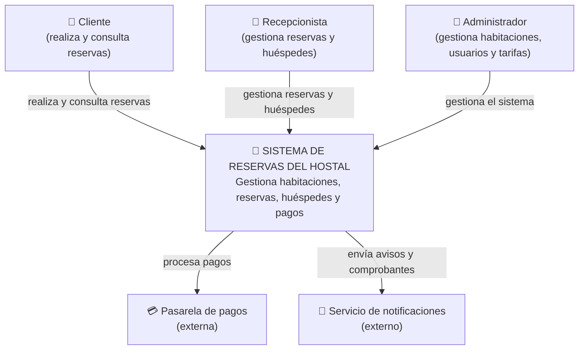
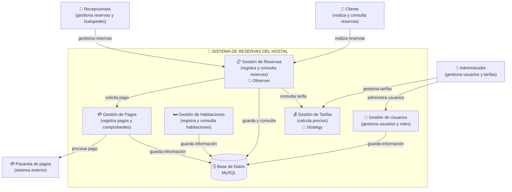

# H4 - Arquitectura del Sistema de Reservas del Hostal

## Nivel 1 — Contexto

En este nivel mostramos el sistema de reservas del hostal desde una vista general aquí se pueden ver las personas que utilizan el sistema y los sistemas externos que tienen relación con él.

## Nivel 2 - Contenedores

En este nivel se muestran las partes principales que están dentro del sistema de reservas del hostal aqui se puede ver dónde se encuentra la logica del sistema donde se guardan los datos como se gestionan los pagos y cómo se envían los avisos

